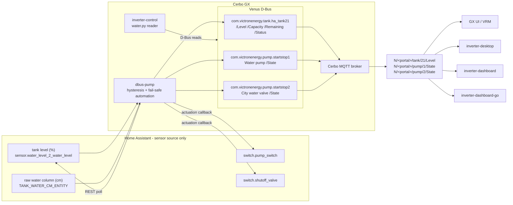
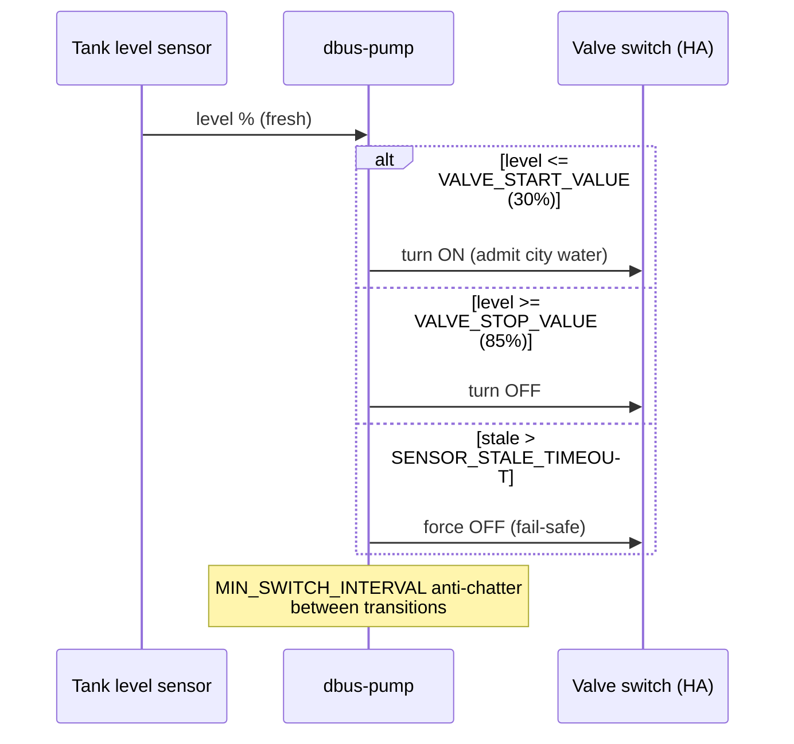

# dbus-pump

Home-Assistant-backed water tank/pump/valve bridge for Victron Venus OS.

Runs **on the Cerbo GX** and exposes a Home Assistant water system as native
Venus services:

- `com.victronenergy.tank.ha_tank<N>` (`DEVICE_INSTANCE_TANK`) — fresh-water tank level (`/Level` in %)
- `com.victronenergy.pump.startstop<P>` (`PUMP_STARTSTOP_INSTANCE`) — well/pressure pump ("Water pump")
- `com.victronenergy.pump.startstop<V>` (`VALVE_STARTSTOP_INSTANCE`) — city-water shutoff valve ("City water valve")

Venus OS bridges these services to Cerbo MQTT topics
`N/<portal>/tank/<instance>/Level` and `N/<portal>/pump/<instance>/State`,
which is what the remote consumers (desktop, dashboards) subscribe to.

The valve admits city water when the tank level drops below the configured
minimum. Automation lives here (not in HA and not in any other client), so
there is a single control plane.

### Water data flow

dbus-pump is the **only** water source for every consumer: Venus services on
D-Bus locally, Cerbo MQTT topics remotely. No client talks to Home Assistant
for water.



Consumers and the paths they read:

| Consumer | Source | Path/topic |
| --- | --- | --- |
| GX UI / VRM | D-Bus | native tank gauge + pump/valve devices |
| inverter-control (on GX) | D-Bus | `com.victronenergy.tank.ha_tank21` `/Level`, `pump.startstop{1,2}` `/State` |
| inverter-desktop | Cerbo MQTT | `N/<portal>/tank/+/Level`, `N/<portal>/pump/+/State` (plain instance in 4th segment) |
| inverter-dashboard | Cerbo MQTT | same, gated by `CERBO_PORTAL_ID` |
| inverter-dashboard-go | Cerbo MQTT | same, `cerbo:` config section |

Valve/pump hysteresis sequence (automation is entirely inside dbus-pump):



## Configuration

Copy `local_config.example.py` to `local_config.py` on the device and fill in:

| Key | Meaning | Default |
| --- | --- | --- |
| `HA_URL` / `HA_TOKEN` | Home Assistant REST endpoint + long-lived token | — |
| `HA_WATER_LEVEL_ENTITY` | tank level sensor (%) | `sensor.water_level_2_water_level` |
| `TANK_CAPACITY_LITERS` | tank size → `/Capacity`; GUIv2 needs it for liters | 0 |
| `TANK_WATER_CM_ENTITY` / `TANK_OFFSET_CM` / `TANK_RADIUS_CM` | raw water-column sensor (cm) + geometry → `/Remaining`, computed here | — |
| `HA_PUMP_SWITCH_ENTITY` | pump switch | `switch.pump_switch` |
| `HA_VALVE_SWITCH_ENTITY` | shutoff valve switch | `switch.shutoff_valve` |
| `DEVICE_INSTANCE_TANK` | D-Bus device instance for the tank service | 21 |
| `PUMP_STARTSTOP_INSTANCE` / `VALVE_STARTSTOP_INSTANCE` | startstop instances | 1 / 2 |
| `VALVE_START_VALUE` / `VALVE_STOP_VALUE` | hysteresis: open below / close above (%) | 30 / 85 |
| `SENSOR_STALE_TIMEOUT` | s without fresh level → force valve CLOSED | 120 |
| `MIN_SWITCH_INTERVAL` | anti-chatter min seconds between transitions | 60 |
| `ENABLE_CONTROL` | master switch for automated actuation | False |

### Tank capacity and remaining liters

GUIv2 shows the tank gauge in percent only until it knows the tank size.
The bridge publishes `/Capacity` from `TANK_CAPACITY_LITERS` (D-Bus uses m³;
liters are converted internally).

Venus OS does not derive `/Remaining` for third-party tanks, and level % is
not volume-proportional when the sensor has a dead zone at the bottom.
dbus-pump therefore computes remaining liters itself from the raw
water-column sensor (`TANK_WATER_CM_ENTITY`, cm):

    liters = (cm − TANK_OFFSET_CM) × π × TANK_RADIUS_CM² / 1000

`TANK_OFFSET_CM` is the sensor reading at an empty tank (site values:
18 cm), `TANK_RADIUS_CM` the cylinder radius (35.56 cm). Readings below
the offset clamp to 0 L. If the raw sensor is unavailable, `/Remaining`
falls back to `Capacity × Level`.

## Install


Via SetupHelper PackageManager (GUI v1): drop the repo in `/data/dbus-pump`
(must contain `version` + `setup`). Then Settings → PackageManager → install,
or:

```sh
/data/dbus-pump/setup install
/data/dbus-pump/setup uninstall
```

`gitHubInfo` is `victron-venus:latest`. Device-local `local_config.py` is not overwritten.


```sh
./deploy.sh          # streams repo to Cerbo, runs update.sh there
./restart.sh         # restart the service only
ssh cerbo 'tail -f /var/log/dbus-pump/current'   # logs
```

Uninstall:

```sh
ssh cerbo 'svc -dk /service/dbus-pump/log /service/dbus-pump; rm /service/dbus-pump'
```

## Safety model

- **Hysteresis**: valve opens at ≤ `VALVE_START_VALUE`, closes at ≥
  `VALVE_STOP_VALUE`. No oscillation around one threshold.
- **Stale sensor fail-safe**: no fresh level reading within
  `SENSOR_STALE_TIMEOUT` → valve forced CLOSED, tank `/Status` = 2 (fault).
- **Manual override**: `/Mode` on each startstop service bypasses automation
  (0 auto, 1 always-on, 2 always-off).
- **Graceful shutdown**: SIGTERM forces the valve CLOSED before exiting.
- Residual risk: if the Cerbo loses power while the valve is open, nothing
  closes it. Accept this or add a hardware NC interlock.

## Conflict with native "Pump start/stop"

If the GX's native *Pump start/stop* relay feature is enabled it owns
`startstop0` plus relay function 3. This service uses instances ≥ 1 by
default so both can coexist; disable the native feature (Settings → Relay)
if you want full GX-side pump semantics.

## D-Bus responsiveness and HA requests

One background worker performs HA HTTP requests, using the existing request
timeout and circuit breaker. Polls never overlap, and a slow poll does not
block D-Bus reads. Results and device-state changes are applied on the GLib
main loop. While a poll is outstanding, the main loop still expires stale
sensor data and evaluates the existing valve fail-safe.

Manual and automatic switch requests use the same worker. The queue holds at
most eight operations; a full queue rejects a new `/Mode` write instead of
blocking D-Bus. An accepted `/Mode` means the request was queued; `/State`
changes only after HA acknowledges it. New commands supersede older queued
commands for the same switch. A request already sent to HA cannot be cancelled,
so an opposite safety decision is queued after it and retried if necessary.
Returning to AUTO re-evaluates the cached sample without making it fresh when
automation is enabled. Monitoring-only operation still does not make automatic
switch decisions.

Shutdown discards pending work, finishes the active request, then attempts the
existing valve-close action on the same worker and closes the HTTP session.
The shutdown wait is bounded to 15 seconds; an exceeded deadline is logged as
an unconfirmed valve closure. Power loss and an unreachable HA remain the
same limits on software-controlled valve closure.

## Troubleshooting

- **Tank shows fault / level frozen**: HA unreachable or sensor stale. The
  circuit breaker opens after 5 consecutive failures for 60 s; last-known
  values keep being served. Check `local_config.py` token validity.
- **Valve not actuating**: `ENABLE_CONTROL` still False? Logs (throttled to
  once/min) say why commands are suppressed.
- **Service down**: `svstat /service/dbus-pump`; multilog under
  `/var/log/dbus-pump`.

## Development

```sh
python3 -m venv .venv && source .venv/bin/activate
pip install -e ".[dev]"
python3 -m pytest tests/
python3 -m ruff check .
```

Tests run fully off-GX (D-Bus and HA are mocked).

## License

MIT — see [LICENSE](LICENSE).


## Venus OS installation and recovery

Use the canonical `/data/dbus-pump` directory. Both `setup install`
(SetupHelper/PackageManager) and the workstation `deploy.sh` call `update.sh`.
A release is staged under volatile `/tmp` before stopping the service, so
reinstalling from the installed tree does not delete the update source.
The updater preserves `local_config.py`; `deploy.sh` deliberately replaces it
when the workstation has a local copy (`PUSH_LOCAL_CONFIG=1`).
Existing service and log directory inodes, ownership, supervisor state and the
canonical `/service` symlink are preserved. Only the application is stopped;
run scripts are replaced atomically and a healthy logger keeps running.
Ordinary updates do not restart PackageManager. A stuck application receives
one supervisor-scoped kill after twenty seconds; installation aborts if it is
still running after twenty-five seconds. Unexpected service links, real `/service`
directories or legacy firmware copies require a separate migration before
updating; the updater leaves them untouched.

Service definitions persist under `/data/dbus-pump/service/dbus-pump`.
`/service/dbus-pump` is a symlink recreated by `/data/rc.local`, including
when that script already ends with `exit 0`. The logger creates
`/var/log/dbus-pump` and uses bounded `multilog` rotation (`s25000 n4`).
On the audited Venus OS image, `/var/log` resolves to persistent `/data/log`,
so these logs write flash. Heartbeats live in volatile `/run` storage.
Runtime data does not require writes to the
read-only firmware filesystem. Firmware updates can replace system Python
packages; check dependencies after each update before assuming the service is
healthy. The installer does not run `pip` or upgrade system packages.

Before installation, check the target interpreter:

```sh
python3 --version
python3 -c "import requests, dbus; from gi.repository import GLib"
```

Verify a running process and its D-Bus data after installation:

```sh
svstat /service/dbus-pump /service/dbus-pump/log
readlink /service/dbus-pump
tail -n 40 /var/log/dbus-pump/current
```

`update.sh` confirms termination before copying but does not wait for a fresh
process or heartbeat after requesting startup. The deployment caller must
verify startup and D-Bus availability.

`deploy.sh` fails if a fresh heartbeat does not appear within 60 seconds or the
service never reaches `up`. A heartbeat proves the loop is running, not that
Home Assistant is reachable: also inspect `/Connected` and the log. Restore a
previous release with its `update.sh`, keeping the device-local configuration.
Installer regressions cover repeated updates with live directory handles,
supervisor-state and ownership preservation, atomic run-script replacement,
configuration, safe rejection before stopping, and boot hooks before `exit 0`.

### Invalid sensor readings

An unavailable, missing or non-finite HA level does not refresh the existing
sensor deadline. AUTO holds its previous decision within that grace window,
then requests the existing stale-sensor valve closure at
`SENSOR_STALE_TIMEOUT` (120 seconds by default). Manual ON/OFF modes retain their
existing priority. A subsequent valid level resumes normal hysteresis without
changing the configured thresholds or timings.
The worker carries the monotonic request start time through callback delivery;
a delayed result cannot renew sensor freshness. Main-loop ticks continue to
write the heartbeat while a request is blocked.

Unknown level and expired tank data publish unavailable `/Level` and
`/Remaining`; unavailable volume is not represented as a measured empty tank.
Non-finite raw height is ignored, allowing the existing capacity/level
calculation when a valid level is present. Malformed JSON objects are handled
as failed polls instead of escaping the worker callback. Deterministic local
tests cover valid-to-unavailable transitions, NaN/infinity, the original stale
deadline, manual modes, volume invalidation and recovery. HA success still does
not independently prove freshness of the physical sensor or valve actuation.

### Native D-Bus startup

The service constructs `VeDbusService` with `register=False`, creates all paths,
applies configured initial values, and then registers each well-known name once.
The production bridge starts with `/Connected = 0` until it has a valid source
snapshot. A failure during initialization does not expose a partial service.
This uses the Venus OS registration lifecycle; it does not change local control
settings, source freshness deadlines, or the installer layout.
