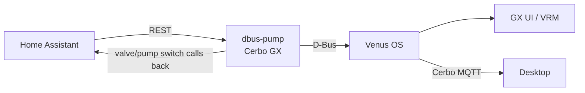

# dbus-pump

Home-Assistant-backed water tank/pump/valve bridge for Victron Venus OS.

Runs **on the Cerbo GX** and exposes a Home Assistant water system as native
Venus services:

- `com.victronenergy.tank.<N>` — fresh-water tank level (`/Level` in %)
- `com.victronenergy.pump.startstop<P>` — well/pressure pump ("Water pump")
- `com.victronenergy.pump.startstop<V>` — city-water shutoff valve ("City water valve")

The valve admits city water when the tank level drops below the configured
minimum. Automation lives here (not in HA and not in any other client), so
there is a single control plane.



## Configuration

Copy `local_config.example.py` to `local_config.py` on the device and fill in:

| Key | Meaning | Default |
| --- | --- | --- |
| `HA_URL` / `HA_TOKEN` | Home Assistant REST endpoint + long-lived token | — |
| `HA_WATER_LEVEL_ENTITY` | tank level sensor (%) | `sensor.water_level_2_water_level` |
| `HA_WATER_VOLUME_ENTITY` | tank volume sensor (L) — optional, see below | — |
| `TANK_CAPACITY_LITERS` | tank size → `/Capacity`; GUIv2 needs it for liters | 0 |
| `HA_PUMP_SWITCH_ENTITY` | pump switch | `switch.pump_switch` |
| `HA_VALVE_SWITCH_ENTITY` | shutoff valve switch | `switch.shutoff_valve` |
| `DEVICE_INSTANCE_TANK` | D-Bus device instance for the tank service | 21 |
| `PUMP_STARTSTOP_INSTANCE` / `VALVE_STARTSTOP_INSTANCE` | startstop instances | 1 / 2 |
| `VALVE_START_VALUE` / `VALVE_STOP_VALUE` | hysteresis: open below / close above (%) | 30 / 85 |
| `SENSOR_STALE_TIMEOUT` | s without fresh level → force valve CLOSED | 120 |
| `MIN_SWITCH_INTERVAL` | anti-chatter min seconds between transitions | 60 |
| `ENABLE_CONTROL` | master switch for automated actuation | False |

### Tank capacity and remaining liters

GUIv2 shows the tank gauge in percent only until it knows the tank size.
The bridge publishes `/Capacity` from `TANK_CAPACITY_LITERS` (D-Bus uses m³;
liters are converted internally).

Venus OS does not derive `/Remaining` for third-party tanks, so the bridge
publishes it itself:

- If `HA_WATER_VOLUME_ENTITY` is set, its value (liters, computed by HA) is
  published directly. Use this when level % is not volume-proportional
  (e.g. an ultrasonic sensor with a dead zone at the bottom).
- Otherwise `/Remaining = Capacity × Level`.

Create the liters sensor in HA (`configuration.yaml`), adjusting `18` (dead
zone, cm) and `35.56` (radius, cm) to your tank:

```yaml
template:
  - sensor:
      - name: "Water tank liters"
        unit_of_measurement: "L"
        device_class: volume_storage
        state_class: measurement
        state: >
          {{ (( states('sensor.water_cm') | float(0) - 18 )
              * 3.141592 * 35.56 * 35.56 / 1000 ) | round(2) }}
```

This yields entity id `sensor.water_tank_liters`.

## Install

```sh
./deploy.sh          # streams repo to Cerbo, runs update.sh there
./restart.sh         # restart the service only
ssh cerbo 'tail -f /var/log/dbus-pump/current'   # logs
```

Uninstall:

```sh
ssh cerbo 'svc -dk /service/dbus-pump/log /service/dbus-pump; rm /service/dbus-pump'
```

## Safety model

- **Hysteresis**: valve opens at ≤ `VALVE_START_VALUE`, closes at ≥
  `VALVE_STOP_VALUE`. No oscillation around one threshold.
- **Stale sensor fail-safe**: no fresh level reading within
  `SENSOR_STALE_TIMEOUT` → valve forced CLOSED, tank `/Status` = 2 (fault).
- **Manual override**: `/Mode` on each startstop service bypasses automation
  (0 auto, 1 always-on, 2 always-off).
- **Graceful shutdown**: SIGTERM forces the valve CLOSED before exiting.
- Residual risk: if the Cerbo loses power while the valve is open, nothing
  closes it. Accept this or add a hardware NC interlock.

## Conflict with native "Pump start/stop"

If the GX's native *Pump start/stop* relay feature is enabled it owns
`startstop0` plus relay function 3. This service uses instances ≥ 1 by
default so both can coexist; disable the native feature (Settings → Relay)
if you want full GX-side pump semantics.

## Troubleshooting

- **Tank shows fault / level frozen**: HA unreachable or sensor stale. The
  circuit breaker opens after 5 consecutive failures for 60 s; last-known
  values keep being served. Check `local_config.py` token validity.
- **Valve not actuating**: `ENABLE_CONTROL` still False? Logs (throttled to
  once/min) say why commands are suppressed.
- **Service down**: `svstat /service/dbus-pump`; multilog under
  `/var/log/dbus-pump`.

## Development

```sh
python3 -m venv .venv && source .venv/bin/activate
pip install -e ".[dev]"
python3 -m pytest tests/
python3 -m ruff check .
```

Tests run fully off-GX (D-Bus and HA are mocked).

## License

MIT — see [LICENSE](LICENSE).
